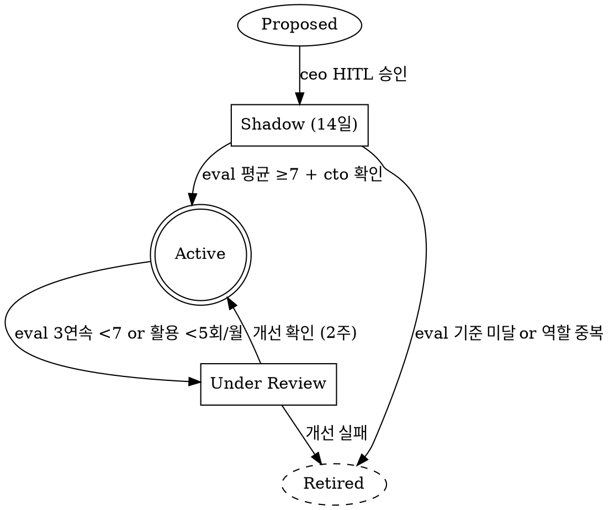

---
paths:
  - .claude/agents/**
  - .claude/lifecycle/**
---

# Agent Lifecycle — 에이전트 라이프사이클 관리

> Loomix v10.0 — 에이전트도 직원과 같이 채용→수습→활성→리뷰→퇴직 사이클을 따른다.

## 상태 기계 (DOT)



## 단계별 정의

### Proposed (제안)
- **파일**: `.claude/lifecycle/proposals/{agent-name}.md`
- **내용**: Why(역할 공백 근거) + Scope(SSOT 경로) + Eval 계획(golden.jsonl 5건 포함)
- **승인**: ceo HITL 결재 필수. TeamCreate 없이 에이전트 신규 추가 금지.

### Shadow (수습, 14일)
- `.claude/agents/{name}.md`에 `shadow: true` 주석 추가
- 실제 Write/Edit 대신 **cto에게 제안만** (`.claude/hooks/shadow_mode.py` 적용)
- 14일 후 eval 평균 ≥7 → Active 전환. cto가 `.claude/agents/` 파일에서 shadow 주석 제거.
- 14일 후 eval <7 → Retired (파일 `.claude/agents/retired/` 이동)

### Active (정상 운영)
- 월간 eval 결과 자동 집계 → `data/exec/agent_performance/{name}-{yyyymm}.json`
- 활용 빈도: cto 주관 월간 리뷰에서 확인

### Under Review (성과 검토)
- cto가 2주 개선 계획 수립 + 에이전트 initialPrompt 보강
- 에이전트 본인(역할)은 "개선 대상" 인지 없음 — cto 단독 판단

### Retired (퇴직)
- 파일 이동: `.claude/agents/{name}.md` → `.claude/agents/retired/{name}-{date}.md`
- `AGENTS.md` 조직도에서 제거 + 이력 주석 추가
- golden.jsonl 보존 (추후 부활 대비)

## 은퇴 트리거 조건
- eval 평균 < 6 && 활용 빈도 < 5회/월 2달 연속
- 역할 중복(다른 에이전트가 동일 역할 흡수)으로 ceo 결정
- Chaos Day에서 대체 가능한 역할임이 검증됨

## 채용 제안 템플릿

```markdown
# 신규 에이전트 제안: {agent-name}

## 1. 근거 (역할 공백)
현재 [X 역할]을 담당하는 에이전트 없음. 월 [N]건 미처리.

## 2. 역할 범위
- 소유 SSOT: data/{domain}/
- 금지 경로: src/, web/
- 모델: sonnet|haiku (복잡도 근거)

## 3. Eval 계획
golden.jsonl 5건 포함 (이 제안서와 함께 첨부)

## 4. 인접 에이전트와의 경계
- vs {agent-A}: 차이점 명시
- vs {agent-B}: 차이점 명시

## 5. 비용 추정
예상 월간 토큰: {N}K, 비용: ${X}
```

## Anti-Patterns
- Shadow 없이 즉시 Active 시작 금지 (ceo HITL로 예외 승인 가능, 단 eval 소급 필수)
- eval 없이 에이전트 .md 변경 금지 (CI gate 차단)
- Retire된 에이전트 복원 시 Shadow 재시작 필수
