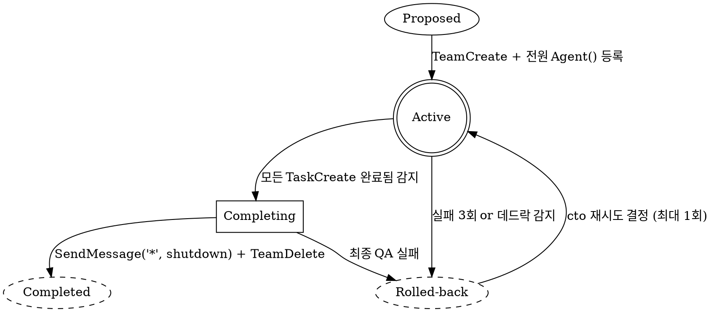

---
paths:
  - .claude/agents/ceo.md
  - .claude/agents/cto.md
  - .claude/agents/qa-auditor.md
---

# Team State — TeamCreate 상태 관리 (StateGraph)

> TeamCreate/TeamDelete 전환 시 상태를 명시해 Orchestration 품질 향상.

## 팀 상태 기계 (DOT)



## 상태 전이 규칙

### Proposed → Active
```python
TeamCreate(team_name="{유형}-{id}")
Agent(...)  # 멤버 등록
# data/exec/team_lifecycle.json에 status: "active" 기록
```

### Active → Rolled-back (자동 감지 조건)
- 동일 Task가 3회 in_progress → completed 실패
- 에이전트 maxTurns 도달로 응답 없음 (데드락)
- 비용 급증 (분당 $1 초과)

**Rollback 프로토콜**:
```python
SendMessage("*", "rollback_request")  # 전 멤버 중단 요청
TeamDelete(team_name="...")
# hitl_signals.json에 team_rollback 신호
# data/exec/team_lifecycle.json에 status: "rolled_back", reason 기록
```

### Completing → Completed
```python
SendMessage("*", "shutdown_request")
# 각 멤버 MEMORY.md Reflection 기록 확인
TeamDelete(team_name="...")
# data/exec/team_lifecycle.json에 status: "completed", duration 기록
```

## 데드락 탐지

```
if (현재 시각 - 마지막 TaskUpdate) > maxTurns * 평균_턴_시간:
    → cto SendMessage("데드락 의심 팀: {team_name}")
    → cto가 직접 개입 또는 Rollback 결정
```

## team_lifecycle.json 스키마

```json
{
  "team_name": "incident-2026-04-15",
  "type": "incident",
  "status": "active|completed|rolled_back",
  "created_at": "ISO8601",
  "completed_at": "ISO8601|null",
  "duration_minutes": 45,
  "members": ["sre-engineer", "pipeline-debugger", "backend-engineer"],
  "tasks_total": 3, "tasks_completed": 3,
  "rollback_reason": null
}
```

## Anti-Patterns
- TeamDelete 없이 세션 종료 금지 → orphan 팀 발생
- Rollback 없이 3회 실패 팀 방치 금지
- 동시 5팀 초과 금지 (상설1 + 미션3 + 감사1)
